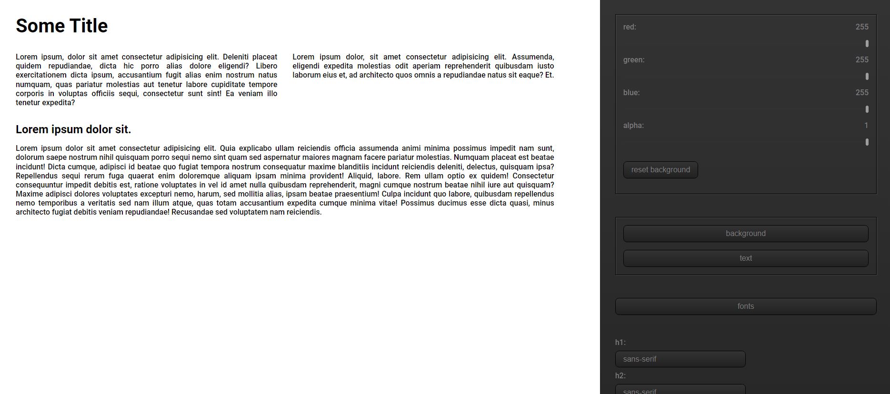
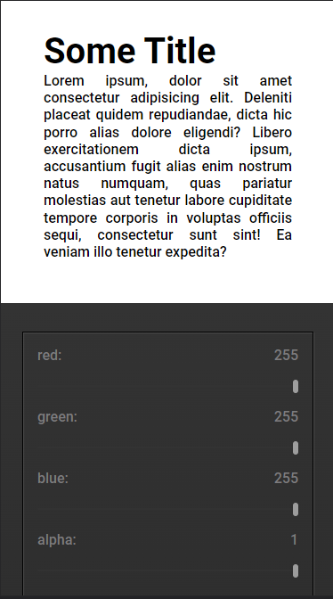

# colormixing app

A small app to visualize, how text, and background colors seem together, with some font family adjustment possibilities.

## Table of contents

- [Overview](#overview)
  
  - [Screenshot](#screenshot)
  - [Links](#links)
- [My process](#my-process)
  - [Built with](#built-with)
  - [What I learned](#what-i-learned)
  - [Continued development](#continued-development)
  - [Useful resources](#useful-resources)
- [Author](#author)
- [Acknowledgments](#acknowledgments)

**Note: Delete this note and update the table of contents based on what sections you keep.**

## Overview

You may change the text, and background colors, with rgb sliders, and (right now) select serif, sans.serif, and cursive font family.

### Screenshot

### Links

- Live Site URL: [colormixing](https://firkaak.github.io/colormixingapp/)

## My process

### Built with

- CSS custom properties
- CSS Grid
- Mobile-first workflow
- javascript

### Continued development

I wonder what features might be usefull in the future. 

## Author

- Website - [milloktamas](https://www.weddingrafix.com)

